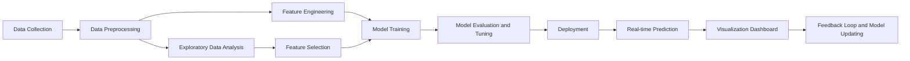

# Performance Prediction Model
The Performance Prediction Model leverages machine learning to forecast future employee performance based on historical data, enhancing talent management and decision-making in HR. This model aims to improve accuracy in performance evaluations, reduce subjective biases, and provide personalized improvement suggestions.

Check out my project through this live link - https://huggingface.co/spaces/TpsNandhini/PerformancePrediction

## Skills Takeaway From This Project
- Data Wrangling
- Exploratory Data Analysis (EDA)
- Feature Engineering
- Model Building
- Performance Evaluation
- Model Deployment

## Domain
### Human Resources (HR) and Talent Management
This project focuses on the critical area of employee performance management within organizations. Challenges in this domain include subjective performance evaluations, lack of data-driven decision-making in talent management, and difficulty in predicting future employee performance.

## Problem Statement
Many organizations struggle with accurately predicting employee performance, leading to ineffective talent management and resource allocation. According to a Gallup study, only 14% of employees strongly agree that their performance reviews inspire them to improve. Poor performance prediction can result in decreased productivity, higher turnover rates, and increased costs for companies.

## Proposed Solution
Develop a machine learning-based Performance Prediction Model that uses historical employee data to forecast future performance. The model will incorporate various factors such as demographic information, work history, training scores, and project completion rates to make predictions. Unique aspects include real-time performance tracking, personalized improvement suggestions, and integration with existing HR systems. Ideal data would include historical performance reviews, project completion rates, training scores, demographic information, and employee engagement survey results.

## Project Workflow/Flowchart

## Technologies Needed
- **Python:** For data processing, analysis, and machine learning model development
- **SQL Databases:** For storing and managing employee data
- **Machine Learning Libraries:** Scikit-learn, TensorFlow, or PyTorch for model development
- **Data Visualization:** Matplotlib, Seaborn, or Plotly for creating insightful visualizations
- **Cloud Platform:** Tidb and Hugging Face for deployment

These technologies are necessary to handle large datasets, implement complex machine learning algorithms, create user-friendly interfaces, and ensure scalability and security of the solution.

## Expected Impact
- Improved accuracy in performance predictions, leading to more effective talent management and resource allocation.
- Reduction in subjective bias in performance evaluations.
- Enhanced employee development through personalized improvement suggestions.
- Increased employee engagement and productivity.
- Cost savings through better workforce planning and reduced turnover.

Quantifiable impacts could include:
- 20% improvement in performance prediction accuracy.
- 15% reduction in employee turnover.
- 10% increase in overall workforce productivity.
- 25% reduction in time spent on manual performance evaluations.

This Performance Prediction Model has the potential to revolutionize how organizations manage and develop their talent, leading to more data-driven decision-making in HR and improved overall organizational performance.
